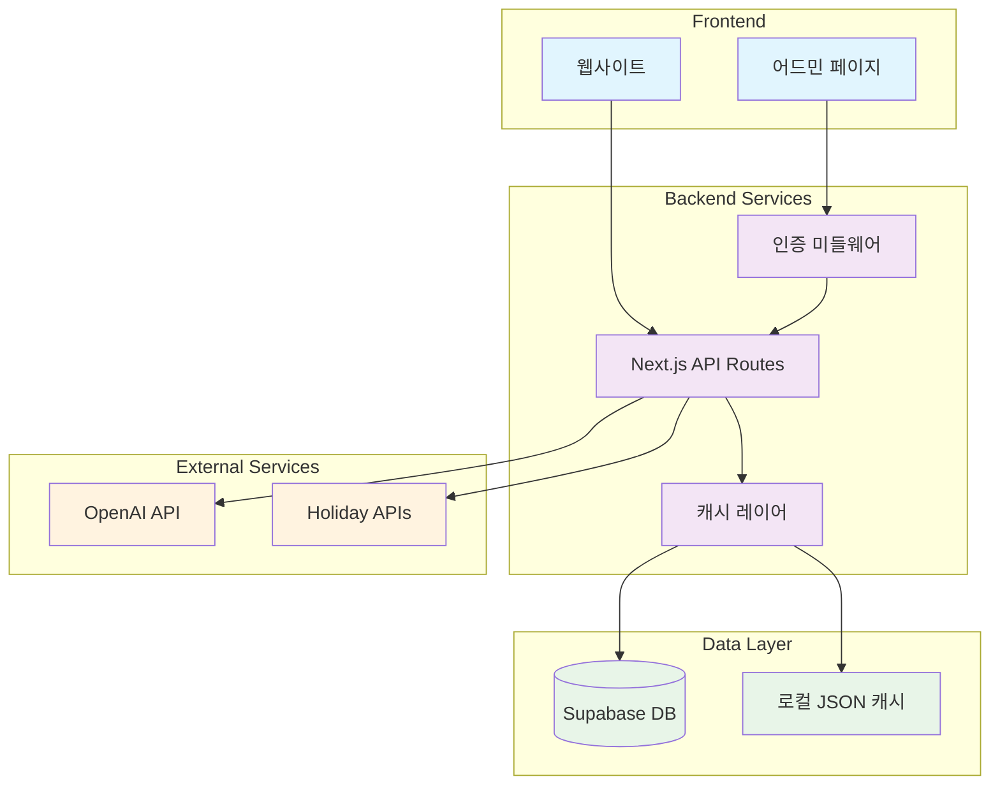
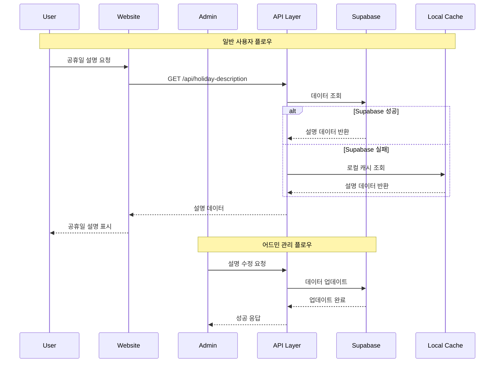

# Design Document

## Overview

이 설계는 기존의 로컬 JSON 파일 기반 AI 캐시 시스템을 Supabase 데이터베이스로 마이그레이션하고, 보안이 적용된 어드민 페이지를 통해 공휴일 설명을 관리할 수 있는 시스템을 구축합니다. 시스템은 점진적 마이그레이션을 지원하며, 기존 API 호환성을 유지하면서 실시간 데이터 관리 기능을 제공합니다.

## Architecture

### 시스템 아키텍처



### 데이터 플로우



## Components and Interfaces

### 1. Supabase 데이터베이스 스키마

#### holiday_descriptions 테이블
```sql
CREATE TABLE holiday_descriptions (
  id UUID DEFAULT gen_random_uuid() PRIMARY KEY,
  holiday_id VARCHAR(255) NOT NULL,
  holiday_name VARCHAR(255) NOT NULL,
  country_name VARCHAR(255) NOT NULL,
  locale VARCHAR(10) NOT NULL DEFAULT 'ko',
  description TEXT NOT NULL,
  confidence DECIMAL(3,2) DEFAULT 0.95,
  generated_at TIMESTAMP WITH TIME ZONE DEFAULT NOW(),
  last_used TIMESTAMP WITH TIME ZONE DEFAULT NOW(),
  modified_at TIMESTAMP WITH TIME ZONE DEFAULT NOW(),
  modified_by VARCHAR(100) DEFAULT 'system',
  is_manual BOOLEAN DEFAULT FALSE,
  ai_model VARCHAR(100),
  created_at TIMESTAMP WITH TIME ZONE DEFAULT NOW(),
  updated_at TIMESTAMP WITH TIME ZONE DEFAULT NOW(),
  
  UNIQUE(holiday_name, country_name, locale)
);

-- 인덱스 생성
CREATE INDEX idx_holiday_descriptions_lookup ON holiday_descriptions(holiday_name, country_name, locale);
CREATE INDEX idx_holiday_descriptions_holiday_id ON holiday_descriptions(holiday_id);
CREATE INDEX idx_holiday_descriptions_modified_at ON holiday_descriptions(modified_at DESC);
CREATE INDEX idx_holiday_descriptions_is_manual ON holiday_descriptions(is_manual);
```

#### admin_sessions 테이블 (세션 관리)
```sql
CREATE TABLE admin_sessions (
  id UUID DEFAULT gen_random_uuid() PRIMARY KEY,
  session_token VARCHAR(255) UNIQUE NOT NULL,
  expires_at TIMESTAMP WITH TIME ZONE NOT NULL,
  created_at TIMESTAMP WITH TIME ZONE DEFAULT NOW(),
  last_accessed TIMESTAMP WITH TIME ZONE DEFAULT NOW(),
  ip_address INET,
  user_agent TEXT
);

CREATE INDEX idx_admin_sessions_token ON admin_sessions(session_token);
CREATE INDEX idx_admin_sessions_expires ON admin_sessions(expires_at);
```

### 2. TypeScript 타입 정의

```typescript
// Supabase 관련 타입
export interface HolidayDescription {
  id: string;
  holiday_id: string;
  holiday_name: string;
  country_name: string;
  locale: string;
  description: string;
  confidence: number;
  generated_at: string;
  last_used: string;
  modified_at: string;
  modified_by: string;
  is_manual: boolean;
  ai_model?: string;
  created_at: string;
  updated_at: string;
}

export interface AdminSession {
  id: string;
  session_token: string;
  expires_at: string;
  created_at: string;
  last_accessed: string;
  ip_address?: string;
  user_agent?: string;
}

// 어드민 관련 타입
export interface AdminDashboardStats {
  totalHolidays: number;
  totalDescriptions: number;
  aiGeneratedCount: number;
  manualCount: number;
  completionRate: number;
  recentModifications: HolidayDescription[];
  countryStats: Array<{
    country: string;
    total: number;
    completed: number;
    rate: number;
  }>;
}

export interface AdminLoginRequest {
  password: string;
}

export interface AdminLoginResponse {
  success: boolean;
  sessionToken?: string;
  expiresAt?: string;
  error?: string;
}

export interface HolidayDescriptionUpdate {
  id: string;
  description: string;
  modified_by: string;
}

export interface HolidayDescriptionCreate {
  holiday_id: string;
  holiday_name: string;
  country_name: string;
  locale: string;
  description: string;
  is_manual: true;
  modified_by: string;
}
```

### 3. API 엔드포인트 설계

#### 공개 API (기존 호환성 유지)
- `GET /api/holiday-description` - 공휴일 설명 조회
- `GET /api/holiday-descriptions/batch` - 여러 설명 일괄 조회

#### 어드민 API
- `POST /api/admin/auth/login` - 어드민 로그인
- `POST /api/admin/auth/logout` - 어드민 로그아웃
- `GET /api/admin/auth/verify` - 세션 검증
- `GET /api/admin/dashboard/stats` - 대시보드 통계
- `GET /api/admin/descriptions` - 설명 목록 조회 (페이지네이션)
- `GET /api/admin/descriptions/missing` - 설명 없는 공휴일 목록
- `PUT /api/admin/descriptions/:id` - 설명 수정
- `POST /api/admin/descriptions` - 새 설명 생성
- `DELETE /api/admin/descriptions/:id` - 설명 삭제

### 4. 컴포넌트 구조

#### 어드민 페이지 컴포넌트
```
src/app/admin/
├── layout.tsx                 # 어드민 레이아웃
├── login/
│   └── page.tsx              # 로그인 페이지
├── dashboard/
│   └── page.tsx              # 대시보드
├── descriptions/
│   ├── page.tsx              # 설명 목록
│   ├── [id]/
│   │   └── edit/
│   │       └── page.tsx      # 설명 편집
│   └── missing/
│       └── page.tsx          # 설명 없는 공휴일
└── components/
    ├── AdminLayout.tsx       # 어드민 레이아웃
    ├── LoginForm.tsx         # 로그인 폼
    ├── DashboardStats.tsx    # 대시보드 통계
    ├── DescriptionList.tsx   # 설명 목록
    ├── DescriptionEditor.tsx # 설명 편집기
    └── MissingDescriptions.tsx # 설명 없는 항목
```

## Data Models

### 1. Supabase 클라이언트 설정

```typescript
// src/lib/supabase.ts
import { createClient } from '@supabase/supabase-js';

const supabaseUrl = process.env.NEXT_PUBLIC_SUPABASE_URL!;
const supabaseAnonKey = process.env.NEXT_PUBLIC_SUPABASE_ANON_KEY!;
const supabaseServiceKey = process.env.SUPABASE_SERVICE_ROLE_KEY!;

// 클라이언트용 (브라우저)
export const supabase = createClient(supabaseUrl, supabaseAnonKey);

// 서버용 (관리자 권한)
export const supabaseAdmin = createClient(supabaseUrl, supabaseServiceKey);
```

### 2. 데이터 액세스 레이어

```typescript
// src/lib/supabase-client.ts
export class SupabaseHolidayDescriptionService {
  async getDescription(holidayName: string, countryName: string, locale: string): Promise<HolidayDescription | null>
  async createDescription(data: HolidayDescriptionCreate): Promise<HolidayDescription>
  async updateDescription(id: string, data: Partial<HolidayDescription>): Promise<HolidayDescription>
  async deleteDescription(id: string): Promise<void>
  async getDescriptions(options: PaginationOptions & FilterOptions): Promise<PaginatedResponse<HolidayDescription>>
  async getMissingDescriptions(): Promise<Array<{holiday_id: string, holiday_name: string, country_name: string}>>
  async getDashboardStats(): Promise<AdminDashboardStats>
  async migrateFromLocalCache(): Promise<{success: number, failed: number, errors: string[]}>
}
```

### 3. 캐시 레이어 (하이브리드 접근)

```typescript
// src/lib/hybrid-cache.ts
export class HybridCacheService {
  private supabaseService: SupabaseHolidayDescriptionService;
  private localCacheService: LocalCacheService;
  
  async getDescription(holidayName: string, countryName: string, locale: string): Promise<CachedContent | null> {
    try {
      // 1. Supabase에서 조회 시도
      const supabaseResult = await this.supabaseService.getDescription(holidayName, countryName, locale);
      if (supabaseResult) {
        return this.convertToLegacyFormat(supabaseResult);
      }
    } catch (error) {
      console.warn('Supabase 조회 실패, 로컬 캐시로 폴백:', error);
    }
    
    // 2. 로컬 캐시로 폴백
    return await this.localCacheService.getCachedDescription(holidayName, countryName, locale);
  }
  
  async setDescription(data: CachedContent): Promise<void> {
    try {
      // 1. Supabase에 저장 시도
      await this.supabaseService.createDescription(this.convertFromLegacyFormat(data));
    } catch (error) {
      console.warn('Supabase 저장 실패, 로컬 캐시에만 저장:', error);
      // 2. 로컬 캐시에 저장
      await this.localCacheService.setCachedDescription(
        data.holidayId, data.holidayName, data.countryName, 
        data.locale, data.description, data.confidence
      );
    }
  }
}
```

## Error Handling

### 1. 에러 타입 정의

```typescript
export enum AdminErrorCode {
  UNAUTHORIZED = 'UNAUTHORIZED',
  INVALID_PASSWORD = 'INVALID_PASSWORD',
  SESSION_EXPIRED = 'SESSION_EXPIRED',
  SUPABASE_CONNECTION_ERROR = 'SUPABASE_CONNECTION_ERROR',
  VALIDATION_ERROR = 'VALIDATION_ERROR',
  NOT_FOUND = 'NOT_FOUND',
  DUPLICATE_ENTRY = 'DUPLICATE_ENTRY'
}

export class AdminError extends Error {
  constructor(
    public code: AdminErrorCode,
    message: string,
    public details?: any
  ) {
    super(message);
    this.name = 'AdminError';
  }
}
```

### 2. 에러 처리 전략

- **Supabase 연결 실패**: 로컬 캐시로 자동 폴백
- **인증 실패**: 로그인 페이지로 리다이렉트
- **세션 만료**: 자동 로그아웃 및 재로그인 요구
- **데이터 검증 실패**: 사용자 친화적 오류 메시지 표시
- **네트워크 오류**: 재시도 메커니즘 및 오프라인 모드 지원

### 3. 로깅 및 모니터링

```typescript
// src/lib/admin-logger.ts
export class AdminLogger {
  static logAdminAction(action: string, userId: string, details?: any): void
  static logSecurityEvent(event: string, ip: string, details?: any): void
  static logSystemError(error: Error, context?: any): void
  static logPerformanceMetric(metric: string, value: number, context?: any): void
}
```

## Testing Strategy

### 1. 단위 테스트
- Supabase 서비스 클래스 테스트
- 하이브리드 캐시 로직 테스트
- 인증 미들웨어 테스트
- 데이터 변환 함수 테스트

### 2. 통합 테스트
- API 엔드포인트 테스트
- 데이터베이스 마이그레이션 테스트
- 어드민 페이지 플로우 테스트
- 폴백 메커니즘 테스트

### 3. E2E 테스트
- 어드민 로그인 플로우
- 설명 편집 및 저장 플로우
- 대시보드 기능 테스트
- 보안 테스트 (무단 접근 차단)

### 4. 성능 테스트
- 대용량 데이터 마이그레이션 테스트
- 동시 접근 테스트
- 캐시 성능 테스트
- API 응답 시간 테스트

## Security Considerations

### 1. 인증 및 권한 관리
- 단일 패스워드 기반 인증 (향후 확장 가능)
- JWT 기반 세션 관리
- 세션 만료 시간 설정 (24시간)
- IP 주소 기반 접근 제한 (선택사항)

### 2. 데이터 보안
- Supabase RLS (Row Level Security) 정책 적용
- API 키 환경 변수 관리
- SQL 인젝션 방지
- XSS 공격 방지

### 3. 네트워크 보안
- HTTPS 강제 사용
- CORS 정책 설정
- Rate limiting 적용
- 어드민 페이지 크롤링 차단

### 4. 감사 로그
- 모든 어드민 액션 로깅
- 로그인 시도 기록
- 데이터 변경 이력 추적
- 보안 이벤트 모니터링

## Deployment and Configuration

### 1. 환경 변수 설정

```bash
# Supabase 설정
NEXT_PUBLIC_SUPABASE_URL=your_supabase_url
NEXT_PUBLIC_SUPABASE_ANON_KEY=your_anon_key
SUPABASE_SERVICE_ROLE_KEY=your_service_role_key

# 어드민 설정
ADMIN_PASSWORD=Gkdud1017!@
ADMIN_SESSION_SECRET=your_session_secret
ADMIN_SESSION_DURATION=86400000  # 24시간 (밀리초)

# 기존 설정 유지
OPENAI_API_KEY=your_openai_key
CALENDARIFIC_API_KEY=your_calendarific_key
```

### 2. 배포 단계
1. Supabase 프로젝트 생성 및 테이블 설정
2. 환경 변수 설정
3. 데이터 마이그레이션 실행
4. 어드민 페이지 배포
5. 기능 테스트 및 검증

### 3. 모니터링 및 유지보수
- Supabase 대시보드를 통한 데이터베이스 모니터링
- Vercel Analytics를 통한 성능 모니터링
- 정기적인 데이터 백업
- 보안 업데이트 및 패치 관리